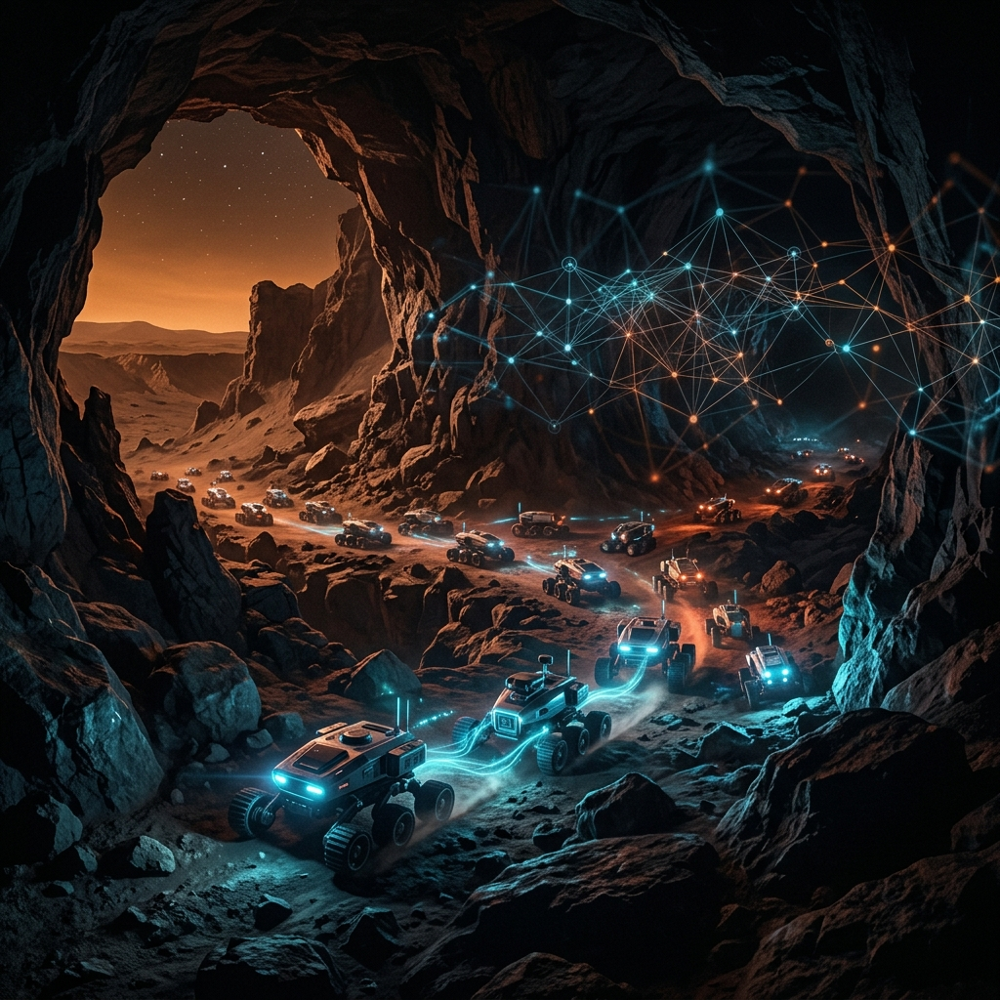
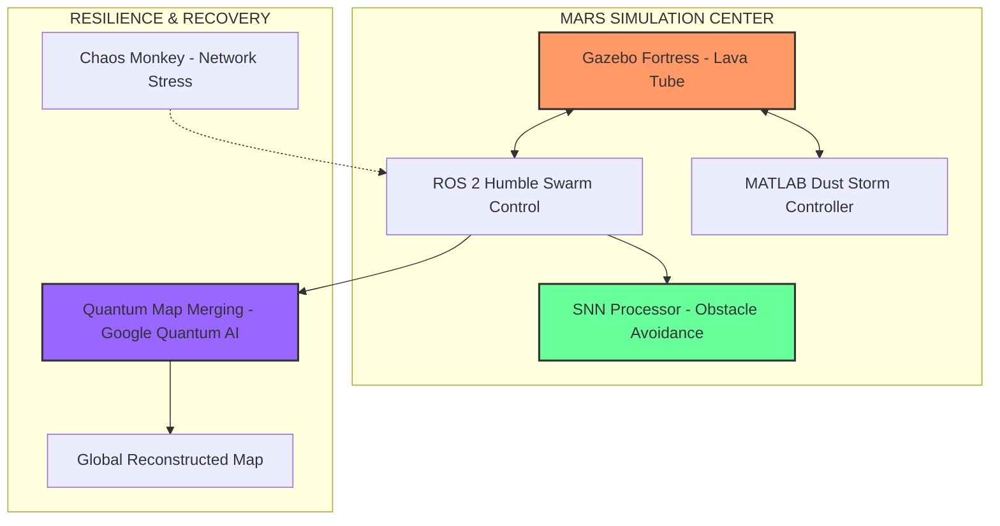

<div align="center">
  

  # 🔴 Martian Swarm Quantum
  
  **Autonomous Swarm Exploration of Martian Environments with Neuromorphic Computing and Quantum Map Recovery**

  [](https://github.com/Chandan118/martian_swarm_quantum/actions)
  [](https://opensource.org/licenses/MIT)
  [](https://docs.ros.org/en/humble/)
  [](https://www.python.org/)
  [](https://quantumai.google/)

  ---
  
  [Overview](#-overview) • [Features](#-key-features) • [Architecture](#-system-architecture) • [Quick Start](#-quick-start) • [Structure](#-project-structure) • [Phase Progress](#-phase-by-phase-implementation) • [AI Tools](#-ai-research-assistant) • [Contributing](#-contributing)
</div>

## 📖 Overview

The **Martian Swarm Quantum** project is a state-of-the-art research platform designed for the autonomous exploration of extreme Martian environments, such as lava tubes and deep canyons. It integrates **Spiking Neural Networks (SNNs)** for energy-efficient neuromorphic navigation and leverages **Google Quantum AI** to solve complex map-merging challenges in multi-agent systems.

Built for resilience, the system undergoes rigorous "Chaos Monkey" stress testing to ensure swarm survival during total communication blackouts and severe Martian dust storms.

---

## 🚀 Key Features

- **🌋 Extreme Environment Simulation**: High-fidelity Gazebo Fortress environments featuring Martian lava tubes, canyons, and randomized rock formations.
- **🌪 Dynamic Dust Storms**: MATLAB-controlled atmospheric hazards that realistically degrade vision and LiDAR sensors in real-time.
- **🧠 Neuromorphic Navigation**: Low-power obstacle avoidance using Leaky Integrate-and-Fire (LIF) Spiking Neural Networks.
- **⚛️ Quantum Map Recovery**: NP-hard multi-agent map fragment merging solved via QUBO formulations on Google Quantum AI infrastructure.
- **🐒 Chaos Resilience**: Randomized communication link severing and blackout simulations to validate swarm autonomy.
- **🐳 Multi-Architecture Support**: Full Docker orchestration optimized for both Ubuntu and Apple Silicon (M1/M2/M3) environments.

---

## 🛠 System Architecture



---

## 📦 Quick Start

### 1. Docker Installation (Recommended)
The easiest way to get started is using Docker Compose, which sets up the entire stack including ROS 2 and Gazebo.

```bash
git clone https://github.com/Chandan118/martian_swarm_quantum.git
cd martian_swarm_quantum/docker
docker-compose up
```

### 2. Native Ubuntu Installation
If you prefer running natively on Ubuntu with ROS 2 Humble installed:

```bash
# Clone and setup
cd ~/martian_swarm_quantum
chmod +x scripts/setup_complete.sh
./scripts/setup_complete.sh

# Launch the simulation
source ~/.bashrc
ros2 launch swarm_control mars_swarm.launch.py
```

### 3. Custom Launch Options
```bash
# Launch with specific rover count and chaos disabled
./scripts/launch_simulation.sh --rovers=8 --no-chaos
```

---

## 📂 Project Structure

| Directory | Description |
|-----------|-------------|
| `docs/` | Comprehensive guides for M2 Mac, Setup, and Phase details. |
| `docker/` | Dockerfiles and Compose configurations for ROS 2, Gazebo, and Quantum. |
| `gazebo_worlds/` | Custom Martian environments and models. |
| `matlab_scripts/`| Dynamic atmospheric hazard controllers. |
| `ros2_ws/` | The core ROS 2 workspace containing swarm and quantum nodes. |
| `scripts/` | Automation tools for setup, launching, and AI-driven maintenance. |
| `tests/` | CI/CD test suites to ensure system stability. |

---

## 🧪 Phase-by-Phase Implementation

### ✅ Phase 1: Dynamic Hazard Environment
- **Gazebo World**: Lava tube/canyon with Mars gravity (3.721 m/s²) and dynamic wind/dust.
- **MATLAB Sync**: Real-time sensor blinding (80% vision impact) during storms.

### ✅ Phase 2: Neuromorphic Swarm Deployment
- **Swarm Control**: 5-10 rovers with multimodal sensor fusion (IMU, LiDAR, Vision).
- **SNN Integration**: LIF neuron model for 8-direction obstacle detection with <1ms latency.

### ✅ Phase 3: Blackout Stress Test
- **Chaos Monkey**: Random link severing and complete network blackouts.
- **Survival Protocols**: Transition to pure local sensor navigation and dead reckoning.

### ✅ Phase 4: Quantum Map Recovery
- **Quantum Optimizer**: QUBO-based alignment of map fragments from surviving rovers.
- **Recovery Engine**: Seamless stitching of global maps using Google Quantum AI.

---

## 🤖 AI Research Assistant & Tools

This project includes custom AI tools to assist in development and maintenance:

### Research Rabbit
AI-powered diagnostics and analysis for your ROS 2 stack.
```bash
python3 scripts/research_rabbit.py diagnostics
```

### Bug Fixer
Automated detection and resolution of common ROS 2 and Python pitfalls.
```bash
python3 scripts/bug_fixer.py . --fix
```

---

## 📈 Performance Benchmarks

| Configuration | RAM Usage | Performance | Latency |
|---------------|-----------|-------------|---------|
| **5 Rovers**  | ~4 GB     | 60 FPS      | <5ms    |
| **10 Rovers** | ~8 GB     | 45 FPS      | <8ms    |
| **Quantum Merge**| ~1 GB  | 5-30s       | N/A     |

---

## 🤝 Contributing

Contributions are welcome! Please follow these steps:
1. Fork the Project.
2. Create your Feature Branch (`git checkout -b feature/AmazingFeature`).
3. Commit your Changes (`git commit -m 'Add some AmazingFeature'`).
4. Push to the Branch (`git push origin feature/AmazingFeature`).
5. Open a Pull Request.

---

## 👥 Contributors

We would like to thank our co-authors for their invaluable contributions to this research:

- **Txinyan** ([@Txinyan](https://github.com/Txinyan))
- **hhtbbc** ([@hhtbbc](https://github.com/hhtbbc))
- **orange0131** ([@orange0131](https://github.com/orange0131))
- **Hailan5** ([@Hailan5](https://github.com/Hailan5))

---

## 📜 License

Distributed under the **MIT License**. See `LICENSE` for more information.

---

<div align="center">
  <b>Built with ❤️ by the Martian Swarm Quantum Team</b><br>
  <i>Pushing the boundaries of autonomous exploration.</i>
</div>
